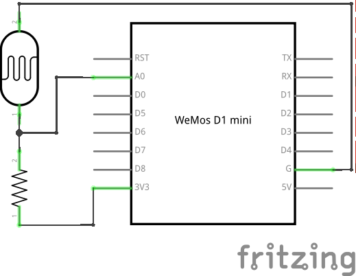

Advanced
********

Analog to Digital Converter
===========================

Our board has only one "analog" pin, ``A0``. That pin is connected to an ADC,
or "analog to digital converter" -- basically an electronic voltmeter, which
can tell you what voltage is on the pin. The one we have can only measure from
0 to 1V, and would be damaged if it got more than 1V, so we have to be careful.

We will connect a photo-resistor to it. It's a special kind of a resistor that
changes its resistance depending on how much light shines on it. But to make
this work, we will need a second, fixed, resistor to make a "volatge divider".
This way the voltage will change depending on the resistance of our
photo-resistor.

Now, we will just read the values in our program, and print them in a loop::

    from machine import ADC
    adc = ADC(0)
    while True:
        print(adc.read())

You should see a column of numbers changing depending on how much light the
photo-resistor has. Try to cover it or point it toward a window or lamp. The
values are from 0 for 0V, to 1024 for 1V. Ours will be somewhere in between.

Communication Protocols
=======================

So far all devices we connected to the board were relatively simple and only
required a single pin. More sophisticated devices are controlled with multiple
pins, and often have very elaborate ways in which you have to change the pins
to make them do something, like sending a character to them, or retrieving a
value. Those ways are often standardized, and already implemented for you, so
that you don't have to care about all the gory details -- you just call
high-level commands, and the libraries and/or hardware in your board handles it
all for you.

Among the most popular protocols are UART, I²C and SPI. We are going to have
examples of each of them, but we are not going to get into details of how they
work internally. It's enough to know that they let you send bytes to the
device, and receive bytes in response.

Temperature and Humidity
========================

The SHT30 sensor shield provides an accurate temperature and humidity sensor
which communicates over the I2C protocol, the same as the OLED shield. This
only needs two pins aside from ground and power; a clock pin (SCL) and a data
pin (SDA). Multiple devices can use the same pins by having a different address
on the bus (more on this later). A library for controlling the SHT30 has been
built into the firmware already::

    from sht30 import SHT30
    sensor = SHT30()
    temperature, humidity = sensor.measure()

Note that another cheaper and less accurate sensor is often used for this
purpose as well, the DHT11/12. These are described in the 'extra' section for
reference.

OLED
====

A small, 64×48 monochrome display. It uses pins ``gpio4`` and ``gpio5`` to talk
with the board with the I²C protocol. It will conflict with any other shield
that uses those pins, but doesn't use I²C, like the neopixel shield or the
relay shield. It can coexist with other shields that use I²C, like the motor
shield.

Up to two such displays can be connected at the same time, provided they have
different addresses set using the jumper on the back.

You can control the display using the ``ssd1306`` library::

    import ssd1306
    from machine import I2C, Pin
    i2c = I2C(-1, Pin(5), Pin(4))
    display = ssd1306.SSD1306_I2C(64, 48, i2c)
    display.fill(0)
    display.text("Hello", 0, 0)
    display.text("world!", 0, 8)
    display.pixel(20, 20, 1)
    display.show()
