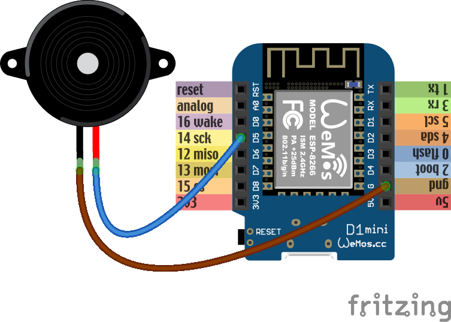

Extra
*****

Servomechanisms
===============

Time to actually physically move something. If you plan on building a robot,
there are three main ways of moving things from the microcontroller:

 * a servomechanism (servo for short),
 * an H-bridge and a DC motor,
 * a stepper or brushless motor with a driver.

We are going to focus on the servo first, because I think this is the easiest
and cheapest way. We are going to use a cheap "hobby" servo, the kind that is
used in toys -- it's not particularly strong, but it's enough for most use
cases.

.. warning::
    Don't try to force the movement of the servo arms with your hand, you are
    risking breaking the delicate plastic gears inside.

A hobby servo has three wires: brown or black ``gnd``, red or orange ``vcc``,
and white or yellow ``signal``. The ``gnd`` should of course be connected to
the ``gnd`` of our board. The ``vcc`` is the power source for the servo, and
we are going to connect it to the ``vin`` pin of our board -- this way it is
connected directly to the USB port, and not powered through the board.

.. caution::
    Servos and motors usually require a lot of current, more then your board
    can supply, and often even more than than you can get from USB. Don't
    connect them to the ``3v3`` pins of your board, and if you need two or
    more, power them from a battery (preferably rechargeable).

The third wire, ``signal`` tells the servo what position it should move to,
using a 50Hz PWM signal. The center is at around 77, and the exact range varies
with the servo model, but should be somewhere between 30 and 122, which
corresponds to about 180° of movement. Note that if you send the servo a signal
that is outside of the range, it will still obediently try to move there --
hitting a mechanical stop and buzzing loudly.  If you leave it like this for
longer, you can damage your servo, your board or your battery, so please be
careful.

So now we are ready to try and move it to the center position::

    from machine import Pin, PWM
    servo = PWM(Pin(14), freq=50, duty=77)

Then we can see where the limits of its movement are::

    servo.duty(30)
    servo.duty(122)

There also exist "continuous rotation" servos, which don't move to the
specified position, but instead rotate with specified speed. Those are suitable
for building simple wheeled robots. It's possible to modify a normal servo into
a continuous rotation servo.

Beepers
=======

When I wrote that PWM has a frequency, did you immediately think about sound?
Yes, electric signals can be similar to sound, and we can turn them into sound
by using speakers. Or small piezoelectric beepers, like in our case.

The piezoelectric speaker doesn't use any external source of power -- it will
be powered directly from the GPIO pin -- that's why it can be pretty quiet.
Still, let's try it::

    from machine import Pin, PWM
    import time

    beeper = PWM(Pin(14), freq=440, duty=512)
    time.sleep(0.5)
    beeper.deinit()

We can even play melodies! For instance, here's the musical scale::

    from machine import Pin, PWM
    import time
    tempo = 5
    tones = {
        'c': 262,
        'd': 294,
        'e': 330,
        'f': 349,
        'g': 392,
        'a': 440,
        'b': 494,
        'C': 523,
        ' ': 0,
    }
    beeper = PWM(Pin(14, Pin.OUT), freq=440, duty=512)
    melody = 'cdefgabC'
    rhythm = [8, 8, 8, 8, 8, 8, 8, 8]

    for tone, length in zip(melody, rhythm):
        beeper.freq(tones[tone])
        time.sleep(tempo/length)
    beeper.deinit()

Unfortunately, the maximum frequency of PWM is currently 1000Hz, so you can't
play any notes higher than that.

It's possible to make the sounds louder by using a better speaker and possibly
an audio amplifier.

Schematics
==========

The pretty colorful pictures that we have been using so far are not very
useful in practical projects. You can't really draw them by hand, different
components may look very similar, and it's hard to see what is going on when
there are a lot of connections. That's why engineers prefer to use more
symbolic representation of connection, a schematic.

A schematic doesn't care how the parts actually look like, or how their pins
are arranged. Instead they use simple symbols. For instance, here's a schematic
of our experiment with the external LED:

The resistor is symbolized by a zig-zag. The LED is marked by a diode symbol
(a triangle with a bar), with additional two arrows showing that it's a light
emitting diode. The board itself doesn't have a special symbol -- instead it's
symbolized by a rectangle with the board's name written in it.

There is also a symbol for "ground" -- the three horizontal lines. Since a lot
of components need to be usually connected to the ground, instead of drawing
all those wires, it's easier to simply use that symbol.

Here are some more symbols:

.. image:: ./images/schematic.png
    :width: 512px

It's important to learn to read and draw electric schematics, because anything
more advanced is going to use them, and you will also need them when asking for
help on the Internet.

Neopixels
=========

Those are actually WS2812B addressable RGB LEDs, but they are commonly known
as "neopixels". You can control individually the brightness and color of each
of the LEDs in a string (or matrix, or ring). The connection is simple:

And the code for driving them is not very complex either, because the library
for generating the signal is included in Micropython::

    from machine import Pin
    import neopixel
    pixels = neopixel.NeoPixel(Pin(14, Pin.OUT), 8)
    pixels[0] = (0xff, 0x00, 0x00)
    pixels.write()

Where ``8`` is the number of LEDs in a chain.  You can create all sorts of
animations, rainbows and pretty effects with those.

Temperature and Humidity
========================

The DHT11 and DHT22 sensors are quite popular for all sorts of weather
stations. They use a single-wire protocol for communication. MicroPython on
ESP8266 has that covered::

    from machine import Pin
    import dht
    sensor = dht.DHT11(Pin(14))
    sensor.measure()
    print(sensor.temperature())
    print(sensor.humidity())

The connections are simple:

LED Matrix and 7-segment Displays
=================================

Adafruit sells a lot of "backpacks" with 7- or 14-segment displays or LED
matrices, that we can control easily over I²C. They use a HT16K33 chip, so that
we don't have to switch on and off the individual LEDs -- we just tell the chip
what to do, and it takes care of the rest.

The schematic for connecting any I²C device will be almost always the same:

.. note::

    The two resistors on the schematic are needed for the protocol to work
    reliably with longer wires. For our experiments, it's enough to rely on
    the pull-up resistors that are built into the board we are using.

The communication with the backpack is relatively simple, but I wrote two
libraries for making it more convenient. For the matrix::

    from machine import I2C, Pin
    from ht16k33_matrix import Matrix8x8
    i2c = I2C(sda=Pin(4), scl=Pin(5))
    display = Matrix8x8(i2c)
    display.brightness(8)
    display.blink_rate(2)
    display.fill(True)
    display.pixel(0, 0, False)
    display.pixel(7, 0, False)
    display.pixel(0, 7, False)
    display.pixel(7, 7, False)
    display.show()

and for the 7- and 14-segment displays::

    from machine import I2C, Pin
    from ht16k33_seg import Seg7x4
    i2c = I2C(sda=Pin(4), scl=Pin(5))
    display = Seg7x4(i2c)
    display.push("8.0:0.8")
    display.show()

TFT LCD Display
===============

The I²C protocol is nice and simple, but not very fast, so it's only good when
you have a few pixels to switch. With larger displays, it's much better to use
SPI, which can be much faster.

Here is an example on how to connect an ILI9340 display:

And here is a simple library that lets you draw on that display::

    from machine import Pin, SPI
    import ili9341
    spi = SPI(miso=Pin(12), mosi=Pin(13), sck=Pin(14))
    display = ili9341.ILI9341(spi, cs=Pin(2), dc=Pin(4), rst=Pin(5))
    display.fill(ili9341.color565(0xff, 0x11, 0x22))
    display.pixel(120, 160, 0)

As you can see, the display is still quite slow -- there are a lot of bytes to
send, and we are using software SPI implementation here. The speed will greatly
improve when Micropython adds hardware SPI support.
