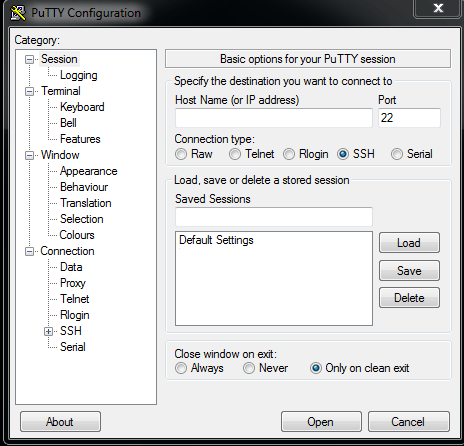
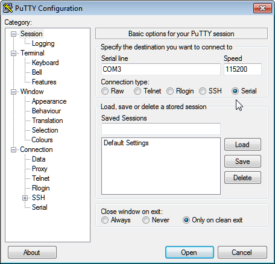

Misc
====

This is just a dumping ground of old material that may still be useful and
I wanted to keep just in case.


Mac
---

MacOS should have the device driver installed as well but we have seen varying
levels of success at previous workshop sessions. Normally connecting with 'screen'
should look similar to the Linux example but the device name will vary depending
on the driver::

    screen /dev/tty.SLAB_USBtoUART 115200

To check if the device is being detected and the driver is working, do `ls /dev/tty*`
to list tty devices on the filesystem with the device disconnected first. Reconnect
the board and do the ```ls /dev/tty*`` again to spot the difference.

This website has some good general troubleshooting instructions for mac serial drivers,
just ignore any bits specific to their paid drivers https://www.mac-usb-serial.com/docs/support/troubleshooting.html.
If the default driver doesn't work, then try to follow the instructions here to
uninstall that and install a new one: https://github.com/MPParsley/ch340g-ch34g-ch34x-mac-os-x-driver

Once the driver is working and you connect with a terminal emulator like screen,
you should get a blank screen and if you hit enter a few times, you should see
the usual python REPL prompt '>>>'. You might see some gibberish characters or
get a SyntaxError when you first connect, that is just the initial serial
connection. To exit screen just disconnect the cable.
Skip to the :ref:`hello-world` section.


Windows
-------

COM port
^^^^^^^^
To figure out what COM port the device is on, either open a CMD window and run the
``mode`` command or open settings and look under Devices and Printers. The
``mode`` command lists all controllable attributes of the console (CON) and more
importantly, the available COM devices. Run it once with the board disconnected
and then again having connected it to find the device that appeared. If there
was no change or there are no COM devices showing, you need to install the driver
first.

CH340 drivers
^^^^^^^^^^^^^

For the serial interface to appear in your system, you may need to install the
drivers_ for CH340. It may be necessary to reboot to load the drivers properly.
Once you have that, you can use either Hyper Terminal or PuTTy to
connect to it.


PuTTy
^^^^^
I'd recommend using Putty which is described in detail here. Run the PuTTy exe
or app from the start menu. You should see a screen similar to the image below.



Now select the Serial mode radio button because we want to make a serial type
connection over USB to the device. Set the Serial Line field to the COM port
number you got from the ``mode`` command e.g COM3. Set the Speed field to 115200
(the unit is bits per second). This is the Baud Rate i.e the connection speed,
you can read more about `Serial Communications`_ online if you're interested.

.. note::

    This image is just for reference, **make sure to set the Serial line to the
    COM port number you found earlier!**



You might want to save this connection profile for convenience, enter a name like
'micro' into the Saved Sessions field and click the Save button. Next time you
connect you can just double-click 'micro' in the list and PuTTy will load the
connection settings. If you have the right COM port and the drivers are working
a black console type window should pop up, it will be blank initially. If not,
double check the steps above regarding COM ports and the drivers.

.. _Serial Communications: https://learn.sparkfun.com/tutorials/serial-communication/all
