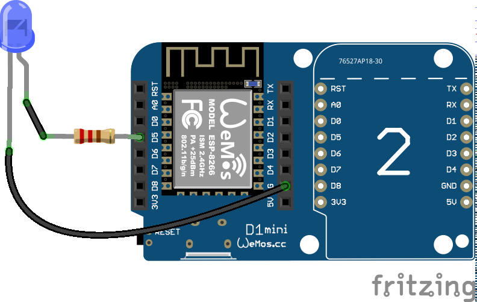
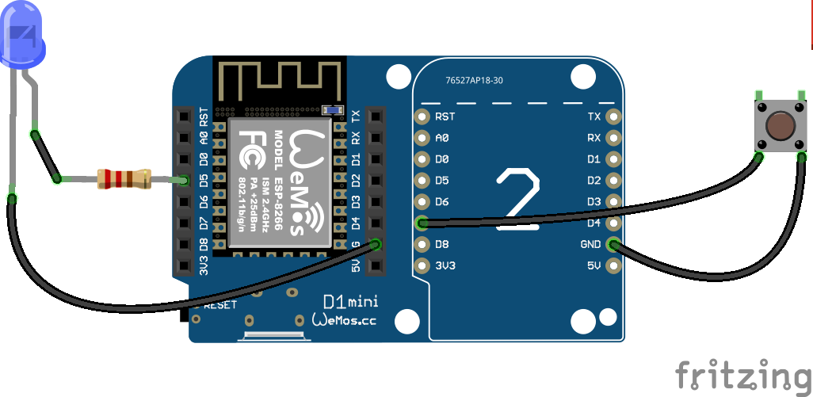
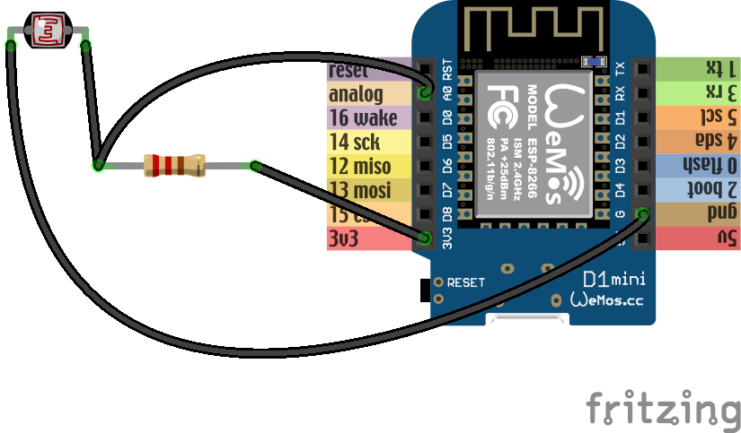

Part 1
******

Blink
=====

The traditional first program for hobby electronics is a blinking light. We
will try to build that.

The boards you have actually have a light built-in, so we can use that. There
is a LED (light-emitting diode) near the antenna (the golden zig-zag). The plus
side of that LED is connected to the ``3v3`` pins internally, and the minus
side is connected to ``gpio2``. So we should be able to make that LED shine
with our program by making ``gpio2`` behave like the gnd pins. We need to
"bring the ``gpio2`` low", or in other words, make it connected to ``gnd``.
Let's try that::

    from machine import Pin

    led = Pin(2, Pin.OUT)
    led(0)

The first line "imports" the "Pin" function from the "machine" module. In
Python, to use any libraries, you first have to import them. The "machine"
module contains most of the hardware-specific functions in Micropython.

Once we have the "Pin" function imported, we use it to create a pin object,
with the first parameter telling it to use ``gpio2``, and the second parameter
telling it to switch it into output mode. Once created, the pin is assigned to
the variable we called "led".

Finally, we bring the pin low, by calling the "led" variable with value 0. At
this point the LED should start shining. In fact, it may have started shining a
line earlier, because once we switched the pin into output mode, its default
state is "low".

Now, how to make the LED stop shining? There are two ways. We could switch it
back into "input" mode, where the pin is not connected to anything. Or we could
bring it "high". If we do that, both ends of the LED will be connected to
"plus", and the current won't flow. We do that with::

    led(1)

Now, how can we make the LED blink 10 times? We could of course type ``led(0)``
and ``led(1)`` ten times quickly, but that's a lot of work and we have
computers to do that for us. We can repeat a command or a set of commands using
the "for" loop::

    for i in range(10):
        led(1)
        led(0)

Note, that when you are typing this, it will look more like::

    >>> for i in range(10):
    ...     led(1)
    ...     led(0)
    ...
    ...
    >>>

That's because the console automatically understands that when you indent a
line, you mean it to be a block of code inside the "for" loop. You have to
un-indent the last line (by removing the spaces with backspace) to finish this
command. You can avoid that by using "paste mode" -- press ``ctrl+E``, paste
your code, and then press ``ctrl+D`` to have it executed.

What happened? Nothing interesting, the LED just shines like it did. That's
because the program blinked that LED as fast as it could -- so fast, that we
didn't even see it. We need to make it wait a little before the blinks, and for
that we are going to use the "time" module. First we need to import it::

    import time

And then we will repeat our program, but with the waiting included::

    for i in range(10):
        led(1)
        time.sleep(0.5)
        led(0)
        time.sleep(0.5)

Now the LED should turn on and off every half second.

External Components
===================

Now let's try the same, but not with the build-in LED -- let's connect an
external LED and try to use that. The connection should look like this:

**Remember the pin numbering does not match the numbers on the board, refer to
the image in the setup page and in each section.**

One leg of the LED is a little bit longer (the one the resistor is soldered to
but it was cut short before the workshop) and the other has a
flattening on the plastic of the LED next to it. The long leg should go to the
plus, and the short one to the minus. We are connecting the LED in opposite way
than the internal one is connected -- between the pin and ``gnd``. That means
that it will shine when the pin is high, and be dark when it's low.

Also note how we added a resistor in there. That is necessary to limit the
amount of current that is going to flow through the LED, and with it, its
brightness. Without the resistor, the LED would shine very bright for a short
moment, until either it, or the board, would overheat and break. We don't want
that.

Now, let's try the code::

    from machine import Pin
    import time

    led = Pin(14, Pin.OUT)
    for i in range(10):
        led(1)
        time.sleep_ms(500)
        led(0)
        time.sleep_ms(500)

Again, you should see the LED blink 10 times, half a second for each blink.

This time we used ``time.sleep_ms()`` instead of ``time.sleep()`` -- it does
the same thing, but takes the number of milliseconds instead od seconds as the
parameter, so we don't have to use fractions.

Pulse Width Modulation
======================

Wouldn't it be neat if instead of blinking, the LED slowly became brighter and
then fade out again? Can we do this somehow?

The brightness of the LED depends on the voltage being supplied to it.
Unfortunately, our GPIO pins only have a simple switch functionality -- we
can turn them on or off, but we can't fluently change the voltage (there are
pins that could do that, called DAC, for "digital to analog converter", but
our board doesn't have those). But there is another way. Remember when we
first tried to blink the LED without any delay, and it happened too fast to
see?

Turns out we can blink the LED very fast, and by varying the time it is on and
off change how bright it seems to be to the human eye. The longer it is on and
the shorter it is off, the brighter it will seem.

Now, we could do that with a simple loop and some very small delays, but it
would keep our board busy and prevent it from doing anything else, and also
wouldn't be very accurate or terribly fast. But the ESP8266 has special
hardware dedicated just for blinking, and we can use that! This hardware is
called PWM (for Pulse Width Modulation), and you can use it like this::

    from machine import Pin, PWM
    import time

    pwm = PWM(Pin(14))
    pwm.duty(896)
    time.sleep(1)
    pwm.duty(512)
    time.sleep(1)
    pwm.duty(0)

If you run this, you should see the external blue led on ``gpio14`` change
brightness. The possible range is from 1023 (100% duty cycle, the LED is on full brightness)
to 0 (0% duty cycle, the LED is off).

You can also change the frequency of the blinking. Try this::

    pwm.freq(1)

That should blink the LED with frequency of 1Hz, so once per second -- we are
basically back to our initial program, except the LED blinks "in the
background" controlled by dedicated hardware, while your program can do other
things!

Buttons
=======

Disconnect the board and remove the SHT30 shield if connected (on the right).
This frees up connections to add the button. ** Note that these are the same
pins as on the left, i.g the labels are the same and they are physically
connected.**

Connect the button to ``Pin 13`` (a.k.a D7) and to ground on the right hand side.

.. note::
    If you have the button with no wires, use D3 ``gpio0`` instead.

Now we will write some code that will switch the LED on and off each time the
button is pressed::

    from machine import Pin
    led = Pin(14, Pin.OUT)
    button = Pin(13, Pin.IN, Pin.PULL_UP)
    while True:
        if not button():
            led(not led())
            while not button():
                pass

We have used ``Pin.IN`` because we want to use ``gpio13`` as an input pin, on
which we will read the voltage. We also added ``Pin.PULL_UP`` -- that means
that there is a special internal resistor enabled between that pin and the
``3V3`` pins. The effect of this is that when the pin is not connected to
anything (we say it's "floating"), it will return 1. If we didn't do that, it
would return random values depending on its environment. Of course when you
connect the pin to ``GND``, it will return 0.

However, when you try this example, you will see that it doesn't work reliably.
The LED will blink, and sometimes stay off, sometimes switch on again,
randomly. Why is that?

That's because your hands are shaking. A mechanical switch has a spring inside
that would shake and vibrate too. That means that each time you touch the wires
(or close the switch), there are in reality multiple signals sent, not just
one. This is called "bouncing", because the signal bounces several times.

To fix this issue, we will do something that is called "de-bouncing". There are
several ways to do it, but the easiest is to just wait some time for the signal
to stabilize::

    import time
    from machine import Pin
    led = Pin(14, Pin.OUT)
    button = Pin(13, Pin.IN, Pin.PULL_UP)
    while True:
        if not button.value():
            led(not led())
            time.sleep_ms(300)
            while not button():
                pass

Here we wait 3/10 of a second -- too fast for a human to notice, but enough for
the signal to stabilize. The exact time for this is usually determined
experimentally, or by measuring the signal from the switch and analyzing it.

Analog to Digital Converter
===========================

Our board has only one "analog" pin, ``A0``. That pin is connected to an ADC,
or "analog to digital converter" -- basically an electronic voltmeter, which
can tell you what voltage is on the pin. The one we have can only measure from
0 to 1V, and would be damaged if it got more than 1V, so we have to be careful.

We will connect a photo-resistor to it. It's a special kind of a resistor that
changes its resistance depending on how much light shines on it. But to make
this work, we will need a second, fixed, resistor to make a "voltage divider".
This way the voltage will change depending on the resistance of our
photo-resistor. Disconnect either the LED or button now to make room.

Now, we will just read the values in our program, and print them in a loop::

    from machine import ADC
    adc = ADC(0)
    while True:
        print(adc.read())

You should see a column of numbers changing depending on how much light the
photo-resistor has. Try to cover it or point it toward a window or lamp. The
values are from 0 for 0V, to 1024 for 1V. Ours will be somewhere in between.
