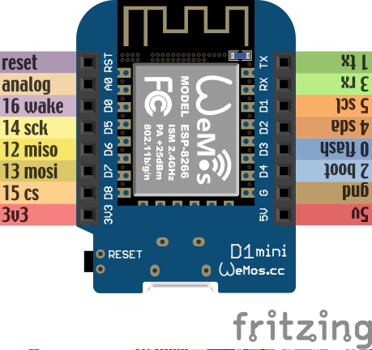

Setup
*****

Prerequisites
=============

To participate in the workshop, you will need the following:

  * A laptop with Linux, Mac OS or Windows and at least one free USB port.
  * If it's Windows or Mac OS, we may need to install `drivers`_ for the CH340
    UBS2TTL chip.
  * A micro-USB cable with data lines that fits your USB port.
  * You will need a terminal application installed. For Linux and Mac you can
    use ``screen``, which is usually installed by default. For Windows we recommend
    `PuTTy`_.
  * Please note that the workshop will be in English.

.. _drivers: https://sparks.gogo.co.nz/ch340.html
.. _PuTTy: https://www.chiark.greenend.org.uk/~sgtatham/putty/latest.html


In addition, at the workshop, you will receive:
  * WeMos D1 Mini development board with ESP8266 on it,
  * WeMos OLED shield,
  * WeMos SHT30 shield,
  * Blue LED,
  * Push button,
  * LDR light sensor (sharing is caring)

The firmware that is flashed on the boards is also available at
https://github.com/MaximusV/d1workshop/blob/master/libs/firmware-combined.bin


Notes on Handling
=================
The board can be disconnected and reconnected at any time, there is no power
off or shut down command you need to issue first. This is typical of
microcontrollers and embedded devices in general, they have to operate in
conditions where power may be unreliable and need to be able to handle sudden
restarts.

**Always disconnect the board from power before adding or removing the shields or
components**. Be careful to align the pins correctly, use the RST pin on top
left for reference. Gently rock the shield back and forth while pulling upwards
to remove it, try not to bend the pins. Sometimes the pins won't fully insert
on some shields or boards so don't try to force it flush.

Note that the pins are exposed on the bottom of the board so don't let that
touch any metal or water as it might short circuit the pins. When plugging in
the components double check you're connecting the right pins, if in doubt ask
somebody to check for you. All that aside, don't worry too much, these devices
are fairly robust and worst case they are cheap replaceable components.
Accidents happen and that's ok!


Development Board
=================

The board we are using is called "WeMos D1 Mini" and has an ESP8266 module
on it, which we will be programming. It comes with the latest version of
MicroPython already setup on it, together with all the drivers we are going
to use.

.. note::
    The D0, D1, D2, ... numbers printed on the board are different from what
    Micropython uses -- because originally those boards were made for a
    different software. Make sure to refer to the image below to determine
    which pins are which.




It has a micro-USB socket for connecting to the computer. On the side is
a button for resetting the board. Along the sides of the board are two rows
of pins, to which we will be connecting cables.

The symbols meaning is as follows:

  * ``3v3`` - this is a fancy way to write 3.3V, which is the voltage that the
    board runs on internally. You can think about this pin like the plus side
    of a battery.
  * ``gnd``, ``G`` - this is the ground. Think about it like the minus side of
    the battery.
  * ``gpioXX`` - "gpio" stands for "general purpose input output". Those are
    the pins we will be using for sending and receiving signals to and from
    various devices that we will connect to them. They can act as output --
    pretty much like a switch that you can connect to plus or to minus with
    your program.  Or they can act as input, telling your program whether they
    are connected to plus or minus.
  * ``a0`` - this is the analog pin. It can measure the voltage that is applied
    to it, but it can only handle up to 3.3V.
  * ``5V`` - this pin is connected with the 5V from your computer. You can
    also use it to power your board with a battery when it's not connected to
    the computer. The voltage applied here will be internally converted to the
    3.3V that the board needs.
  * ``rst`` - this is a reset button (and a corresponding pin, to which you can
    connect external button).

Many of the gpio pins have an additional function, we will cover them separately.


Connecting
==========

The board you got should already have MicroPython with all the needed libraries
flashed on it. In order to access its console, you will need to connect it to
your computer with the micro-USB cable, and access the serial interface that
appears with a terminal program.


Linux
-----

On Linux you may need to install `screen` but the device drivers should exist
already::

    sudo screen /dev/ttyUSB0 115200

You should get see a blank terminal screen and if you press 'enter' you should see
a line like '>>>' which means you're in the REPL. Skip to the :ref:`hello-world` section.

If you don't get to the REPL, try unplug the cable once and try again. Failing
that, try another cable.

MacOS
-----

MacOS should have the device driver installed as well but we have seen varying
levels of success at previous workshop sessions. Normally connecting with 'screen'
should look similar to the Linux example but the device name will vary depending
on the driver::

    screen /dev/tty.SLAB_USBtoUART 115200

To check if the device is being detected and the driver is working, do `ls /dev/tty*`
to list tty devices on the filesystem with the device disconnected first. Reconnect
the board and do the ```ls /dev/tty*`` again to spot the difference.

This website has some good general troubleshooting instructions for mac serial drivers,
just ignore any bits specific to their paid drivers https://www.mac-usb-serial.com/docs/support/troubleshooting.html.
If the default driver doesn't work, then try to follow the instructions here to
uninstall that and install a new one: https://github.com/MPParsley/ch340g-ch34g-ch34x-mac-os-x-driver

Once the driver is working and you connect with a terminal emulator like screen,
you should get a blank screen and if you hit enter a few times, you should see
the usual python REPL prompt '>>>'. You might see some gibberish characters or
get a SyntaxError when you first connect, that is just the initial serial
connection. To exit screen just disconnect the cable.
Skip to the :ref:`hello-world` section.


Windows
-------

.. note::
    When I tested this recently I found that Windows 7 and 10 automatically
    installed the right drivers when connected to the internet so connect the
    board first and see if the autoinstaller pops up in the taskbar. Follow the
    steps below to see if the device is detected. If the device doesn't appear,
    then you may need to install the drivers manually as described.

COM port
^^^^^^^^
To figure out what COM port the device is on, either open a CMD window and run the
``mode`` command or open settings and look under Devices and Printers. The
``mode`` command lists all controllable attributes of the console (CON) and more
importantly, the available COM devices. Run it once with the board disconnected
and then again having connected it to find the device that appeared. If there
was no change or there are no COM devices showing, you need to install the driver
first.

CH340 drivers
^^^^^^^^^^^^^

For the serial interface to appear in your system, you may need to install the
drivers_ for CH340. It may be necessary to reboot to load the drivers properly.
Once you have that, you can use either Hyper Terminal or PuTTy to
connect to it.


PuTTy
^^^^^
I'd recommend using Putty which is described in detail here. Run the PuTTy exe
or app from the start menu. You should see a screen similar to the image below.

.. image:: ./images/putty1.png
    :width: 512px

Now select the Serial mode radio button because we want to make a serial type
connection over USB to the device. Set the Serial Line field to the COM port
number you got from the ``mode`` command e.g COM3. Set the Speed field to 115200
(the unit is bits per second). This is the Baud Rate i.e the connection speed,
you can read more about `Serial Communications`_ online if you're interested.

.. note::

    This image is just for reference, * make sure to set the speed to 115200! *


You might want to save this connection profile for convenience, enter a name like
'micro' into the Saved Sessions field and click the Save button. Next time you
connect you can just double-click 'micro' in the list and PuTTy will load the
connection settings. If you have the right COM port and the drivers are working
a black console type window should pop up, it will be blank initially. If not,
double check the steps above regarding COM ports and the drivers.

.. _Serial Communications: https://learn.sparkfun.com/tutorials/serial-communication/all


.. _hello-world:

Hello world!
============

Once you are connected, press "enter" and you should see the Micropython
prompt, that looks like this::

    >>>

.. note::

    You may see some gibberish characters or an Error type message like 'could not
    find main.py', that's expected. As long as you can hit "enter" and see the
    ``>>>`` prompt then it's working!

It's traditional to start with a "Hello world!" program, so type this and press
"enter"::

    print("Hello world!")

If you see "Hello world!" displayed in the next line, then congratulations, you
got it working.

Python Basics
=============
If this is your first time ever using Python, this section will run over some of
the main things to know for getting started. Remember, Micropython is just an
implementation of the Python language interface so for basic behaviour
everything is the same as regular Python here.

The REPL
--------
We're currently connected to the Python REPL (Read-Execute-Print-Loop) which is
a quick and easy way to play around with Python code. If you install and run
regular Python on your computer, you can also run the REPL. The MicroPython
REPL has some handy extra features; it will remember the last 8 lines of code, it will
auto-indent blocks for you, it has a special paste mode ``Ctrl+d`` and it has
Tab completion, meaning it will offer suggestions for available methods on a
module or instance when you press the Tab key. Try to get used to these as we
go through the tutorial.

For actual complex Python programs running as services, the code is written into
a file with a ``.py`` extension and then executed with the Python interpreter
(often referred to as Python *scripts* or *modules*). Later in the tutorial we
will look at putting files onto the devices over the WebREPL.

Variables
---------

Python is a dynamically typed language which means you don't have to declare the
type of variables (unlike statically typed languages like C and Java)::

    x = 1
    y = "string"
    z = []
    type(x)

    type(y)

You can change the type of a variable at any time, you don't have to stick to
the original type::

    x = 1
    x = "x is now a string!"
    type(x)

This may seem weird if you're used to statically typed languages and it does
sometimes lead to subtle bugs but in general it is rarely a problem. The ``type``
builtin function used to check the types here is just for illustation, it is very
rarely needed when writing Python in general.

Whitespace Delimited
--------------------

Python is whitespace delimited which means that the whitespaces in the files
are used for flow control between blocks, loops, functions etc. In most other
popular languages, the curly brace chars ``{}`` are used as delimiters but you
also generally indent codes by convention for ease of reading. Python chose to
remove the braces as they are redundant if you are indenting blocks anyway and
it makes for much cleaner code to read.

It is important that you use whitespace OR tabs for indentation but not both.
If you're using an editor the easiest thing is to set tabs to use whitespaces.
The Micropython REPL handes indentation automatically for you. As a rule, whereever
you see the colon character, ``:``, the next line must be indented. This is usually
applies to class and function definitions, conditional blocks (if/else) and loops::

    def adder(x, y):
        return x + y

    result = adder(1, 3)
    print("Result is {}".format(result))

    test = False
    if test is True:
        print("yes")
    else:
        print("no")

When you're typing an indented block and hit enter, the REPL will auto-indent to
the next line for you because it doesn't know if you want to write more in that
block or not. The line will start with three dots ``...`` and then a suitable
amount of indented whitespace. You have to press "enter" three times to complete
the block and unindent, or manually delete the indented space to close that block.
This catches some people out at first so keep it in mind.

Loops
-----

Loops in Python are fairly intuitive::

    # lists can contain multiple types!
    example_list = [0, 1, 3, "cat", "dog"]

    for item in example_list:
        print(item)

    for i in range(0, 10):
        print(i)

    from time import sleep
    while True:
        # loop forever! ctrl-c to exit
        print("Looping..")
        sleep(1)
        # Press enter three times to close the loop or delete the auto-indent!

Modules
-------
Python comes with loads of useful standard libraries for all sorts of things,
math, web requests, logging, testing etc. The ``import`` keyword is used to load
external libraries or modules into memory so we can call their methods etc. So
when you're importing things, you're calling functions defined elsewhere.
Let's prove this by creating a script::

    # use the open function to open a file in write mode 'w'
    new_file = open("example.py", "w")
    # note that we have to 'escape' the quote characters inside the string with
    # backslash. Why is that do you think?
    new_file.write("print(\"Test\")")
    new_file.close()

    # when importing we don't specify the .py, the 'module' is just the name
    import example

This should print out 'Test' when you first import it. But what if you import it
again? Nothing happens! This is because the file is interpreted into machine code
when it is imported so simple statements like ``print`` calls get executed.
Normally modules consist of classes and functions to be used multiple times and
it would be a waste of memory and CPU to interpret the file everytime it is imported.

Official Documentation and Support
==================================

The official documentation for this port of Micropython is available at
http://micropython.org/resources/docs/en/latest/esp8266/. There is a also a
forum on which you can ask questions and get help, located at
http://forum.micropython.org/. Finally, there are ``#esp8266`` and
``#micropython`` channels on http://freenode.net IRC network, where people chat
in real time. Remember that all people there are just users like you, but
possibly more experienced, and not employees who get paid to help you.
